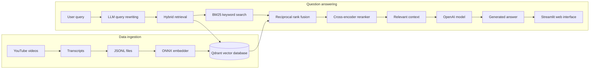
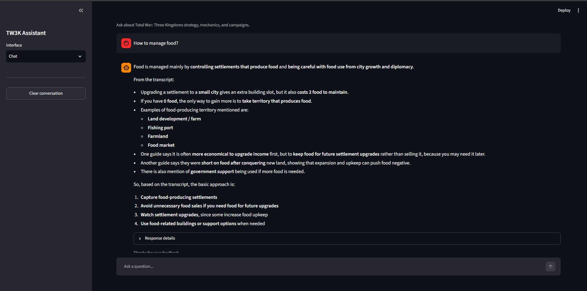
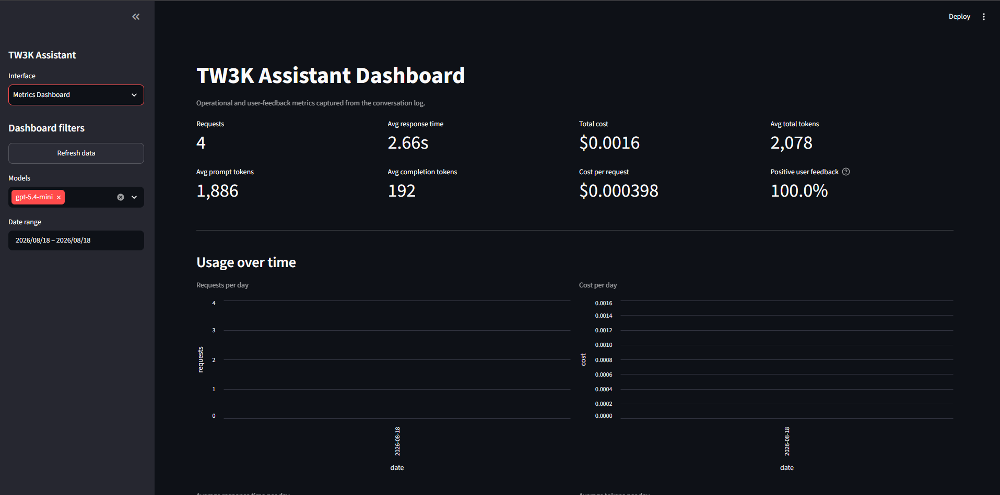

# Total War: Three Kingdoms AI Assistant


When playing *Total War: Three Kingdoms* (TW3K) by Creative Assembly, it can be difficult to decide what to do next. I often searched online for tips and guides that would help me play more effectively.

The [Serious Trivia YouTube channel](https://www.youtube.com/channel/UCw64RL17YRZtEbE7gbDltpQ) has many comprehensive TW3K guides, but the videos are long and there are many of them. This inspired me to build a knowledge base from the videos' transcripts and use a large language model (LLM) to answer questions based on the relevant context.

The source data comes from another tool that I used to convert several videos from the channel into text stored in JSON Lines (`.jsonl`) format. This application is intended for TW3K players who want an easier way to access that information.

## Architecture

This retrieval-augmented generation (RAG) application uses the following workflow:



### Data ingestion

1. **Prepare the transcripts:** Convert the selected YouTube videos into text and divide each transcript into smaller passages that can be retrieved independently.
2. **Store the dataset:** Save the passages and their metadata—such as video, timestamp, and source information—in a JSON Lines (`.jsonl`) file.
3. **Create embeddings:** Use the ONNX `all-MiniLM-L6-v2` model to transform each passage into a dense vector representing its semantic meaning.
4. **Build the knowledge base:** The Compose initialization service loads the dataset and indexes the vectors and passage metadata in Qdrant. Existing populated collections are reused unless a rebuild is explicitly requested.

### Question answering

1. **Accept the question:** The user submits a TW3K question through the Streamlit chat interface.
2. **Rewrite the query:** An LLM turns the question into a clear, standalone search query while preserving important game terminology.
3. **Retrieve candidates:** BM25 finds passages with matching terms, while Qdrant vector search finds passages with similar meaning.
4. **Fuse and rerank:** Reciprocal rank fusion combines both result lists, and a cross-encoder reranker selects and orders the most relevant passages.
5. **Generate a grounded answer:** The selected passages and original question are sent to the OpenAI model, which is instructed to answer only from the retrieved context.
6. **Return and monitor the response:** Streamlit streams the answer to the user, stores request metrics in PostgreSQL, and allows the user to submit helpful or not-helpful feedback.

## Tech Stack

| Component | Technology |
| --- | --- |
| LLM and query rewriting | OpenAI GPT-5.4 mini through the Responses API |
| Embedding model | Hugging Face `Xenova/all-MiniLM-L6-v2` |
| Embedding runtime | ONNX Runtime |
| Lexical retrieval | BM25 with `rank-bm25` |
| Vector retrieval | Qdrant |
| Retrieval fusion | Reciprocal Rank Fusion (RRF) |
| Document reranking | `cross-encoder/ms-marco-MiniLM-L-6-v2` |
| Retrieval evaluation | Ragas |
| Web interface and dashboard | Streamlit |
| Metrics and feedback storage | PostgreSQL with Psycopg |
| Containerization | Docker and Docker Compose |
| Package management | uv |

## Retrieval Method

The application evaluates three retrieval strategies:

| Retrieval strategy | Context Precision @5 | Context Recall @5 |
| --- | :---: | :---: |
| BM25 lexical search | 0.8429 | 0.4348 |
| Vector search | 0.7807 | 0.4128 |
| Hybrid search with reranking | **0.8594** | **0.4262** |

The evaluation compares BM25 lexical search, Qdrant vector search, hybrid reciprocal rank fusion, and hybrid retrieval with reranking. Based on the recorded Ragas results, hybrid retrieval combined with the `cross-encoder-ms-marco-MiniLM-L-6-v2` reranker performs best and is therefore used by the application. The evaluation measures the top five retrieved contexts.

The project does not yet include a comparative evaluation of final LLM answers or prompt variants. The reported results evaluate retrieval quality only.

## LLM Metrics and Monitoring

The application captures operational metrics for every successful LLM request and stores them in PostgreSQL. This provides a persistent record for reviewing usage, performance, cost, and answer quality through the Streamlit dashboard.

The captured data includes:

- The user's question and the generated answer
- The model, developer instructions, and complete grounded prompt
- Input, output, and total token counts
- Response time in seconds
- Estimated cost per request
- Request timestamp
- Optional helpful or not-helpful user feedback

The Streamlit monitoring dashboard includes summary metrics, filters, recent request details, and six charts:

1. Requests per day
2. Cost per day
3. Average response time per day
4. Average tokens per day
5. Requests by model
6. Cost by model

### Best Practices

- **Hybrid search:** BM25 lexical and Qdrant vector results are combined using reciprocal rank fusion.
- **Document reranking:** A cross-encoder reranks the hybrid candidates before context is sent to the LLM.
- **Query rewriting:** An LLM converts the user's question into a clear, standalone retrieval query.

Additional engineering features include streamed answers, per-request token and cost tracking, persistent conversation history, and idempotent database and vector-index initialization.

## Project Structure

```text
tw3k-ai-assistant/
|-- src/tw3k_ai_assistant/ # Application, RAG, retrieval, UI, and database code
|-- scripts/               # Model download, Qdrant ingestion, and synthetic data tools
|-- evaluation/            # Retrieval evaluation scripts and recorded results
|-- notebooks/             # Retrieval experiments
|-- data/                  # Transcript knowledge-base dataset
|-- tests/                 # Application and Docker Compose tests
|-- _docs/                 # Project workflow and team documentation
|-- compose.yaml           # Complete local application stack
|-- Dockerfile             # Application container image
|-- pyproject.toml         # Python project and dependency configuration
|-- uv.lock                # Locked dependency versions
`-- README.md              # Project overview and setup instructions
```

## Setup and Run

### Prerequisites

- Docker Desktop, or Docker Engine with the Compose v2 plugin
- Git
- An OpenAI API key

The first startup requires network access to download the ONNX embedding model.

### Start with Docker Compose

Clone the repository and enter the project directory:

```bash
git clone https://github.com/ubicilembusaparua/tw3k-ai-assistant.git
cd tw3k-ai-assistant
```

Create the environment file:

```bash
cp .env.example .env
```

Set `OPENAI_API_KEY` in `.env`, then build and start the complete stack:

```bash
docker compose up --build -d
```

Compose downloads the embedding model, initializes PostgreSQL, ingests the tracked dataset into Qdrant, and starts Streamlit. Open the application at <http://localhost:8501> and the Qdrant dashboard at <http://localhost:6333/dashboard>.

Inspect service status and logs with:

```bash
docker compose ps
docker compose logs -f app
docker compose logs -f qdrant-init
```

Stop the services while retaining the database, vectors, and model cache:

```bash
docker compose down
```

## Web Interface

### Chat

Ask questions and receive grounded answers from the TW3K transcript knowledge base.



### Metrics Dashboard

Review request volume, response time, token usage, cost, model usage, and user feedback.


