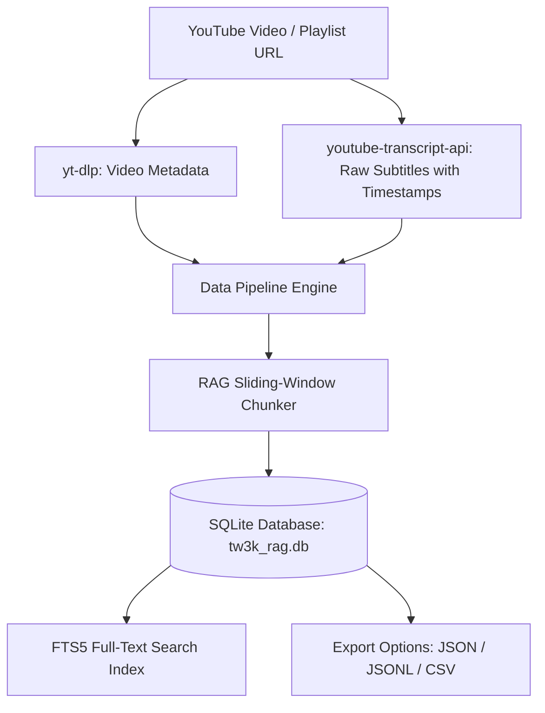

# 🎮 Total War: Three Kingdoms - YouTube RAG Dataset Builder

An educational, modular Python toolkit designed to convert **YouTube videos and playlists** into timestamped, structured datasets optimized for **Retrieval-Augmented Generation (RAG)** systems.

Supports storage in **SQLite** (with Full-Text Search FTS5), **JSON**, **JSONL** (standard format for vector embedding ingestion and LLM fine-tuning), and **CSV**.

---

## 🌟 Features

- 🎥 **YouTube Transcript & Metadata Extraction**: Automatically fetches video details (title, channel, duration) and timestamped subtitles/captions using `youtube-transcript-api` and `yt-dlp`.
- 🧩 **RAG Sliding-Window Chunker**: Intelligently aggregates short raw caption fragments into coherent text blocks (configurable chunk size and overlap) while retaining timestamp links (`https://youtube.com/watch?v=...&t=120s`).
- 🗄️ **Multi-Format Dataset Storage**:
  - **SQLite (`tw3k_rag.db`)**: Structured tables for `videos` and `chunks`, plus **FTS5 (Full-Text Search)** virtual tables for keyword searching.
  - **JSON (`.json`)**: Deep nested hierarchical structure.
  - **JSONL (`.jsonl`)**: Line-delimited JSON, ideal for OpenAI embeddings, ChromaDB, FAISS, or LangChain datasets.
  - **CSV (`.csv`)**: Tabular export ready for Excel or Pandas analysis.
- 🖥️ **Dual User Interface**:
  - **Interactive CLI**: Rich terminal UI with spinners, colorized tables, and interactive menus (`python main.py`).
  - **Web Dashboard**: Modern dark-mode web application (`python main.py --web`) built with FastAPI.

---

## 🏗️ How It Works under the Hood



### 1. Transcript Aggregation & Chunking Strategy
Raw YouTube captions are broken into short 2 to 5 second micro-fragments:
> `[00:15]` "Welcome to Liu Bei guide."
> `[00:18]` "First upgrade tax collectors."

If ingested raw into a RAG vector database, these tiny fragments lack semantic context.

Our **Sliding-Window Chunker** aggregates sequential fragments into target blocks (default: **500 characters** ~80-100 words) with **100-character overlap**.

- **Start/End Timestamps**: Recorded from the first and last segment in each chunk.
- **Deep Links**: Automatically constructs `https://youtube.com/watch?v=VIDEO_ID&t=SECONDSs` so your RAG LLM can generate exact video citations!

---

## 🚀 Quick Start with `uv`

### 1. Synchronize Dependencies
Install and synchronize dependencies using `uv`:

```bash
uv sync
```

### 2. Run Test Suite
Run the test suite with pytest via `uv`:

```bash
# Run entire test suite
uv run pytest

# Run specific test file
uv run pytest tests/test_home.py
```

### 3. Running the Interactive CLI Menu
Launch the interactive terminal menu using `uv run`:

```bash
uv run main.py
```

Options available in the CLI menu:
1. Process a single YouTube video URL
2. Process an entire YouTube playlist URL
3. Search stored dataset (SQLite Full-Text Search)
4. Inspect database summary statistics
5. Export dataset (JSON / JSONL / CSV)

### 4. Launching the Web Dashboard
Launch the web interface at `http://localhost:8000`:

```bash
uv run main.py --web
```

---

## 💻 Command Line Examples

```bash
# Process a single video
uv run main.py --video "https://www.youtube.com/watch?v=dQw4w9WgXcQ" --chunk-size 500 --overlap 100

# Process a playlist
uv run main.py --playlist "https://www.youtube.com/playlist?list=YOUR_PLAYLIST_ID"

# Search stored dataset
uv run main.py --search "Liu Bei economy"

# Export dataset to JSONL
uv run main.py --export jsonl
```


---

## 📁 Repository Structure

```
tw3k-ai-assistant/
├── main.py                # Main CLI & Web Server entrypoint
├── pyproject.toml         # Python project configuration
├── requirements.txt       # Dependencies
├── README.md              # Documentation & educational guide
├── templates/
│   └── index.html         # Dark-mode Web Dashboard UI
├── src/
│   ├── __init__.py
│   ├── models.py          # Pydantic data models & timestamp formatters
│   ├── youtube_fetcher.py # Metadata & transcript extraction
│   ├── chunker.py         # RAG text chunker with sliding window
│   ├── storage.py         # SQLite connection, FTS5 search & export modules
│   ├── cli.py             # Rich terminal CLI
│   └── web_app.py         # FastAPI REST server & Web routes
└── tests/
    └── test_pipeline.py   # Automated unit tests
```

---

## 🎓 Next Steps: Building the Full RAG System

Once you've built your dataset with this tool:

1. **Vector Database Ingestion**:
   - Load `tw3k_dataset.jsonl` into **ChromaDB**, **FAISS**, or **Qdrant**.
   - Embed each chunk using an embedding model (e.g. `text-embedding-3-small` or `nomic-embed-text`).
2. **LLM Query Engine**:
   - Pass user questions (e.g. *"How do I win as Sun Jian in Three Kingdoms?"*) to the vector store.
   - Retrieve top matching chunks and pass them as context to your LLM (OpenAI, Gemini, or Ollama/Llama-3).
   - Display response with the `timestamp_link` so users can verify sources directly on YouTube!
